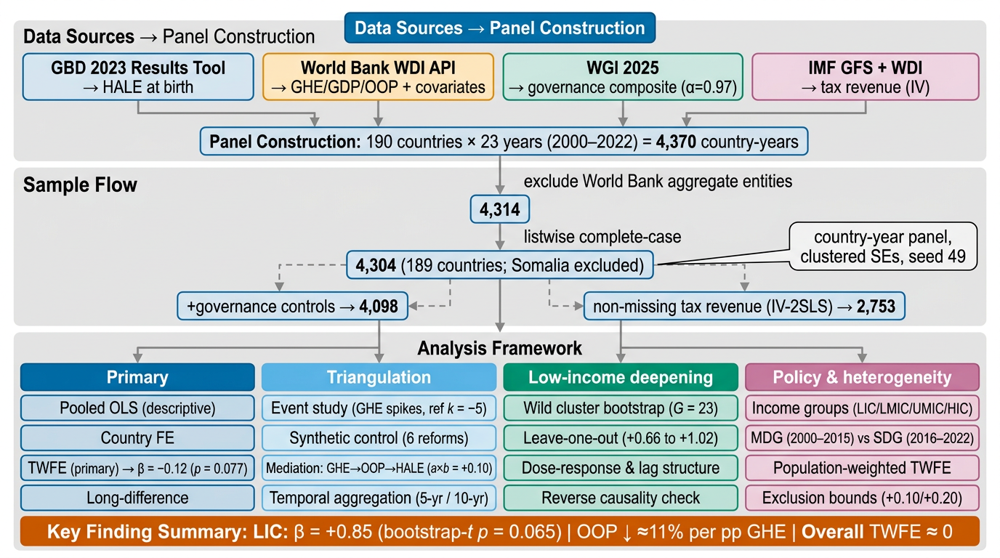
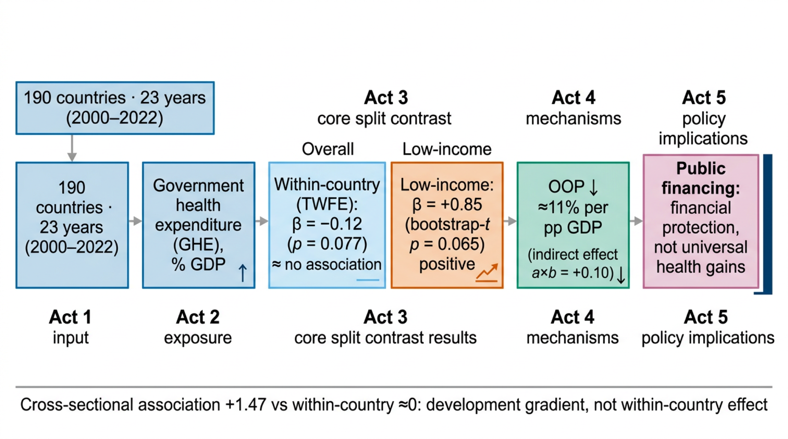

# Government health expenditure was not associated with gains in healthy life expectancy in 190 countries, except in low-income settings: a panel analysis, 2000–2022

[](https://doi.org/10.5281/zenodo.22278049)

[English](README.md) | [简体中文](README_zh.md)

## A Global Country-Year Panel Analysis

### Authors
Qingqing Mo¹², Pingbo Chen¹², Cheng Xu¹², Ya Wang¹², Ting Hu¹², Qian Sun¹², Tao Zhu¹²✉

¹ Department of Obstetrics and Gynecology, National Clinical Research Center for Obstetrics and Gynecology, Tongji Hospital, Tongji Medical College, Huazhong University of Science and Technology, Wuhan, China
² Key Laboratory of Cancer Invasion and Metastasis (Ministry of Education), Tongji Hospital, Tongji Medical College, Huazhong University of Science and Technology, Wuhan, China

Correspondence: Tao Zhu, zhutao@tjh.tjmu.edu.cn
Emails: Qingqing Mo qingqingmo520@tjh.tjmu.edu.cn; Pingbo Chen supercpb520@163.com; Cheng Xu watt15629030676@tjh.tjmu.edu.cn; Ya Wang misswangya@hotmail.com; Ting Hu huting_tj@163.com; Qian Sun sunqian@tjh.tjmu.edu.cn

---

## Overview

This repository contains the complete replication package for the manuscript *"Government health expenditure was not associated with gains in healthy life expectancy in 190 countries, except in low-income settings: a panel analysis, 2000–2022"* (target journal: The Lancet Global Health). All tables, figures, and statistical outputs can be reproduced from publicly available data using the scripts provided.

### Key findings
- The within-country association between domestic government health expenditure (GHE) and healthy life expectancy (HALE) is near zero overall (two-way fixed-effects β = −0.12, p = 0.077), in sharp contrast to the large positive cross-sectional association (+1.47).
- The low-income stratum shows a positive association (β = +0.85; clustered p = 0.030; cluster bootstrap p = 0.065, 9,999 replications), with all 23 leave-one-out estimates positive (+0.66 to +1.02), concentrated in the MDG era (+1.27, p = 0.038) and attenuated to null in the SDG era (+0.03, p = 0.928).
- GHE is associated with improved financial protection: each percentage point of GDP shifted into public financing corresponds to an ≈11% relative reduction in out-of-pocket spending (indirect effect a×b = +0.10; cluster bootstrap 95% CI +0.02 to +0.23).

### Study design



Study design, sample construction (4,370 → 4,314 → 4,304 country-years; 189 countries), and analytical framework (primary TWFE, event studies, synthetic control, OOP pathway decomposition, low-income bootstrap robustness, income-group and era heterogeneity).

### Graphical abstract



Visual summary of the study story: 190-country panel (2000–2022) → GHE exposure → within-country association near zero overall (TWFE β = −0.12, p = 0.077) but positive in low-income countries (β = +0.85, cluster bootstrap p = 0.065) → out-of-pocket spending falls ≈11% per percentage point of GDP (indirect effect a×b = +0.10) → policy implication: public financing buys financial protection, not universal health gains.

---

## Repository Structure

```
ghe-oop-hale-panel/
├── code/                          # 30 analysis scripts (R 4.5.0 primary; Python 3.9+ utilities)
│   ├── 01_main_analysis.R         # Primary TWFE analysis
│   ├── 03_event_study.R           # Event study around GHE spikes (ref k = −5)
│   ├── 04_mediation_oop.R         # OOP pathway decomposition
│   ├── 10_wild_bootstrap_E5.R     # Low-income wild cluster bootstrap
│   ├── A2_synthetic_control_reforms.R  # SCM case studies
│   ├── archive/                   # One-off development scripts (not part of the pipeline)
│   └── ...                        # Full pipeline: 01–15, A1–A3, B1–B4, C1–C4
├── results/
│   ├── tables/                    # All analysis tables (CSV)
│   ├── figures/                   # Publication figures (PDF, Wong colour-blind palette)
│   └── panel/                     # Model objects and processed panel (RDS)
├── submission/                    # STROBE/GATHER checklists, screening records
└── data/                          # Data dictionary and processing notes
```

## Reproducibility

- **Environment**: R 4.5.0 (fixest 0.13.1, data.table 1.16.4, tidysynth 0.2.0, mice 3.17.3, ggplot2 3.5.1, fwildclusterboot 0.13.0), Python 3.9+.
- **Random seed**: 49 for all stochastic procedures.
- **Data sources** (all public): GBD 2023 Results Tool (HALE), World Bank WDI API (GHE, GDP, OOP, covariates), WGI 2025 (governance), IMF GFS (tax revenue).
- **Pipeline order**: 01 → 02 → … → 15, then A1–C4 supplementary scripts.
- Figures are single-panel PDFs in `results/figures/`; tables as CSV in `results/tables/`.

## License

MIT License (see LICENSE). Data are from public sources (GBD, World Bank, WGI, IMF) subject to their respective terms.
