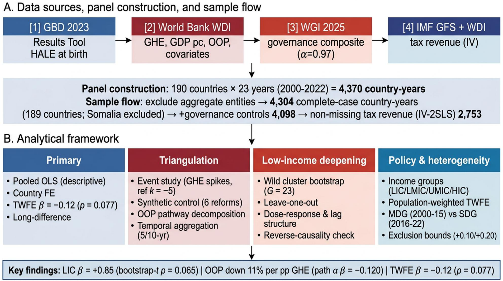

# 政府卫生支出、自付医疗支出与健康预期寿命：190个国家2000–2022年面板分析

[](https://doi.org/10.5281/zenodo.22278049)

[English](README.md) | [简体中文](README_zh.md)

## 全球国家-年份面板研究

### 作者
墨青青¹²、陈平波¹²、徐成¹²、王亚¹²、胡婷¹²、孙茜¹²、朱涛¹²✉

¹ 华中科技大学同济医学院附属同济医院妇产科，国家妇产疾病临床医学研究中心，武汉
² 教育部肿瘤侵袭转移重点实验室，华中科技大学同济医学院附属同济医院，武汉

通讯作者：朱涛，zhutao@tjh.tjmu.edu.cn
邮箱：墨青青 qingqingmo520@tjh.tjmu.edu.cn；陈平波 supercpb520@163.com；徐成 watt15629030676@tjh.tjmu.edu.cn；王亚 misswangya@hotmail.com；胡婷 huting_tj@163.com；孙茜 sunqian@tjh.tjmu.edu.cn

---

## 概述

本仓库为论文《Domestic Government Health Expenditure, Out-of-Pocket Spending, and Healthy Life Expectancy in 190 Countries, 2000–2022》（投稿目标期刊：The Lancet Global Health）的完整复现包。所有表格、图形与统计结果均可使用公开数据与本仓库脚本复现。

### 主要发现
- 国内政府卫生支出（GHE）与健康预期寿命（HALE）的**组内关联整体接近零**（双向固定效应 β = −0.12, p = 0.077），与横截面大正关联（+1.47）形成鲜明对比。
- **低收入组**呈正关联（β = +0.85；wild cluster bootstrap-t p = 0.065），对逐一剔除稳健（+0.66至+1.02），集中于MDG时代（+1.27, p = 0.038），SDG时代衰减至零（+0.03, p = 0.928）。
- GHE与财务保护改善相关：每增加1个百分点GDP的公共筹资，自付医疗支出相对下降约11%（间接效应 a×b = +0.10；bootstrap 95% CI +0.02至+0.24）。

### 研究设计



研究设计、样本构建（4,370 → 4,314 → 4,304国年；189国）与分析框架（主TWFE、事件研究、合成对照、OOP路径分解、低收入组bootstrap稳健性、收入组与时代异质性）。

### 图形摘要


研究故事可视化摘要：190国面板（2000–2022）→ GHE暴露 → 组内关联整体近零（TWFE β = −0.12, p = 0.077）但低收入国为正（β = +0.85, bootstrap-t p = 0.065）→ 自付支出每1个百分点GDP下降约11%（间接效应 a×b = +0.10）→ 政策含义：公共筹资带来财务保护而非普遍健康改善。

---

## 仓库结构

```
ghe-oop-hale-panel/
├── code/                          # 30个分析脚本（R 4.5.0为主；Python 3.9+工具）
│   ├── 01_main_analysis.R         # 主TWFE分析
│   ├── 03_event_study.R           # GHE激增事件研究（参考期 k = −5）
│   ├── 04_mediation_oop.R         # OOP路径分解
│   ├── 10_wild_bootstrap_E5.R     # 低收入组wild cluster bootstrap
│   ├── A2_synthetic_control_reforms.R  # SCM案例研究
│   ├── archive/                   # 一次性开发脚本（不属于正式管线）
│   └── ...                        # 完整管线：01–15、A1–A3、B1–B4、C1–C4
├── results/
│   ├── tables/                    # 全部分析表（CSV）
│   ├── figures/                   # 出版图（PDF，Wong色盲友好调色板）
│   └── panel/                     # 模型对象与处理后面板（RDS）
├── submission/                    # STROBE/GATHER清单、文献筛选台账
└── data/                          # 数据字典与处理说明
```

## 复现说明

- **环境**：R 4.5.0（fixest 0.13.1、data.table 1.16.4、tidysynth 0.2.0、mice 3.17.3、ggplot2 3.5.1、fwildclusterboot 0.13.0）、Python 3.9+
- **随机种子**：所有随机过程 seed = 49
- **数据来源**（均为公开数据）：GBD 2023 Results Tool（HALE）、World Bank WDI API（GHE/GDP/OOP/协变量）、WGI 2025（治理）、IMF GFS（税收）
- **管线顺序**：01 → 02 → … → 15，随后 A1–C4 补充脚本
- 图为单panel PDF（`results/figures/`）；表为CSV（`results/tables/`）。

## 许可

MIT License（见LICENSE）。数据来自公开来源（GBD、World Bank、WGI、IMF），受各自条款约束。
